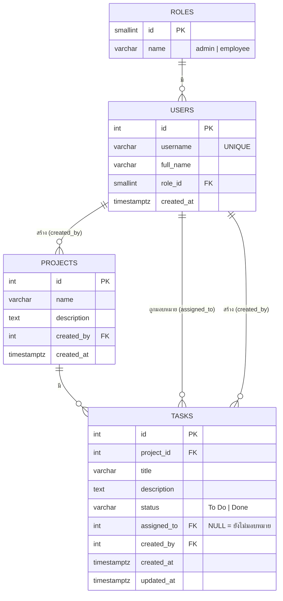

# Project Access Control — Intern Test

ระบบจัดการสิทธิ์การเข้าถึงข้อมูลโครงการ (Role-Based Access Control) สำหรับ 2 Role: **Admin** และ **Employee**
ใช้ Mock Data เท่านั้น (ไม่เชื่อมต่อฐานข้อมูลจริง)

## โครงสร้างโปรเจกต์

| โฟลเดอร์ | เนื้อหา |
|---|---|
| `section-1/` | Flowchart + AI Prompts |
| `section-2/` | Database Schema (`schema.sql`) — รายละเอียดอยู่ใน README นี้ |
| `section-3/` | Source Code ของ Web App |
| `section-4/` | Debugging & Code Review |

---

## ส่วนที่ 2.1 — Tech Stack และเหตุผลที่เลือก

เลือกจากสิ่งที่ flowchart ใน `section-1/flowchart.html` ต้องการ: หน้า Login, Route Guard `/admin` และ `/employee`, Session เก็บ `userId` + `Role`, API จำลองที่หน่วงเวลา, และการกรอง Task ตาม `assigned_to`

| เทคโนโลยี | ใช้ทำอะไร | เหตุผลที่เหมาะกับงานนี้ |
|---|---|---|
| **JavaScript (ES2022)** | ภาษาหลัก | ตรงกับโค้ด Backend ในส่วนที่ 4 (Node.js) ทำให้ใช้ภาษาเดียวทั้งโปรเจกต์ และมี `Promise`/`async-await` สำหรับจำลอง API |
| **React 18** | UI | แยกหน้าเป็น Component ได้ชัด (Login, AdminPage, EmployeePage, TaskList) และ State เปลี่ยน → UI อัปเดตทันที ตรงกับโจทย์ "สร้าง Task แล้วแสดงผลทันที" |
| **Vite** | Build tool / Dev server | เริ่มโปรเจกต์เร็ว, Hot Reload เร็ว, config น้อย เหมาะกับเวลาทดสอบ 3 ชั่วโมง |
| **React Router v6** | Routing + Route Guard | ทำ `/login`, `/admin`, `/employee` ได้ตรงตัว และเขียน `<ProtectedRoute allowedRole="admin">` ครอบเพื่อตรวจ Role แล้ว `<Navigate>` ไปหน้าที่ถูกต้อง (ตรงกับกล่อง RBAC Guard ใน flowchart) |
| **Context API** (`AuthContext`, `TaskContext`) | จัดการ State | State ที่ต้องแชร์มีแค่ 2 อย่าง คือ ผู้ใช้ปัจจุบัน (userId, Role) และรายการ Task จึงไม่จำเป็นต้องใช้ Redux ที่ซับซ้อนกว่า |
| **Mock API** (`Promise` + `setTimeout`) | จำลองเรียก API | ตรงกับขั้นตอน "จำลองเรียก API ตรวจสอบผู้ใช้" ใน flowchart และทำให้เห็น Loading state เหมือนระบบจริง |
| **sessionStorage** | เก็บ Session | ให้ Refresh หน้าแล้วยังไม่หลุด และ Logout แล้วล้างได้ง่าย (ตรงกับขั้น "ล้างข้อมูล Session/Login") |
| **CSS ธรรมดา / CSS Modules** | จัดสไตล์ | ไม่ต้องติดตั้งเพิ่ม ลด dependency |

**ข้อสังเกตด้านความปลอดภัย:** การตรวจสิทธิ์ฝั่ง Frontend (Route Guard, กรอง `assigned_to`) เป็นเพียงการควบคุม UX เท่านั้น ในระบบจริงต้องตรวจซ้ำที่ Backend ทุกครั้ง (ดูตัวอย่างในส่วนที่ 4) และไม่ควรเชื่อ `userRole` ที่ส่งมาจาก Client

---

## ส่วนที่ 2.2 — Database Schema

ไฟล์ SQL เต็ม: [`section-2/schema.sql`](section-2/schema.sql) (PostgreSQL)

### ER Diagram



### รายละเอียด Table

**roles** — `id (PK)`, `name (UNIQUE)`

**users** — `id (PK)`, `username (UNIQUE)`, `full_name`, `role_id (FK → roles.id)`, `created_at`

**projects** — `id (PK)`, `name`, `description`, `created_by (FK → users.id)`, `created_at`

**tasks** — `id (PK)`, `project_id (FK → projects.id)`, `title`, `description`, `status (CHECK: 'To Do' | 'Done')`, `assigned_to (FK → users.id, nullable)`, `created_by (FK → users.id)`, `created_at`, `updated_at`

### ความสัมพันธ์ (Relationship)

| ความสัมพันธ์ | ชนิด | ความหมาย |
|---|---|---|
| roles → users | 1 : N | 1 Role มีได้หลาย User, 1 User มี 1 Role |
| users → projects | 1 : N | Admin 1 คนสร้างได้หลาย Project |
| projects → tasks | 1 : N | 1 Project มีหลาย Task (ลบ Project แล้ว Task ถูกลบตาม) |
| users → tasks (`assigned_to`) | 1 : N | Employee 1 คนได้รับหลาย Task, 1 Task มอบหมายได้ 1 คน |
| users → tasks (`created_by`) | 1 : N | Admin ผู้สร้าง Task |

### การทำ Normalization

- **1NF:** ทุกคอลัมน์เป็นค่าเดี่ยว ไม่มี array หรือค่าซ้ำในช่องเดียว
- **2NF:** ทุก Table ใช้ PK เดี่ยว (`id`) จึงไม่มี partial dependency
- **3NF:** แยก `roles` ออกจาก `users` เพื่อไม่ให้ชื่อ Role ซ้ำในทุกแถว และไม่เก็บชื่อผู้ใช้/ชื่อ Project ซ้ำใน `tasks` (อ้างผ่าน FK แทน)

### การเชื่อมกับ Flowchart (RBAC)

| จุดใน Flowchart | การรองรับในฐานข้อมูล |
|---|---|
| ตรวจ Role หลัง Login | `users.role_id → roles.name` |
| Admin ดู Task ทั้งหมด | `SELECT * FROM tasks` |
| Employee กรอง `assigned_to === userId` | `SELECT * FROM tasks WHERE assigned_to = :userId` + `idx_tasks_assigned_to` |
| `Task.assigned_to === CurrentUser.id` ก่อนแก้สถานะ | `UPDATE ... WHERE id = :taskId AND assigned_to = :userId` (0 แถว = ปฏิเสธ) |
| Admin มอบหมาย Task | `UPDATE tasks SET assigned_to = :employeeId` |
| สถานะ To Do → Done | `tasks.status` พร้อม `CHECK` constraint |

**ข้อจำกัดที่ตั้งใจ:** การห้ามมอบหมาย Task ให้ผู้ที่ไม่ใช่ Employee ไม่ได้บังคับที่ระดับ DB (ต้องใช้ trigger) จึงให้ Application ตรวจก่อน `INSERT/UPDATE`

### โครงสร้าง Mock Data (section-3)

Mock Data ใน Web App ใช้รูปแบบเดียวกับ Schema นี้ เพื่อให้เปลี่ยนไปใช้ฐานข้อมูลจริงได้ง่าย:

```js
users:    [{ id: 1, username: 'admin',   fullName: 'Admin User',     role: 'admin' },
           { id: 2, username: 'somchai', fullName: 'Somchai Jaidee', role: 'employee' }]
projects: [{ id: 1, name: 'Website Redesign', createdBy: 1 }]
tasks:    [{ id: 1, projectId: 1, title: 'ออกแบบหน้า Home', status: 'To Do', assigned_to: 2 }]
```

---

## วิธีรัน Web App (section-3)

```bash
cd section-3
npm install
npm run dev     # เปิด http://localhost:5173
```

บัญชีสำหรับทดสอบ (Mock Data — ในแอปเก็บเฉพาะ SHA-256 hash ไม่ใช่รหัสผ่านจริง):

| Username | Password | Role |
|---|---|---|
| `admin` | `Admin@123` | Admin |
| `somchai` | `Somchai@123` | Employee |
| `somying` | `Somying@123` | Employee |

**RBAC ใน Mock API:** Login สำเร็จได้ `token` (Server จำ token → userId) ทุก API รับเฉพาะ token แล้วหา Role จากฐานข้อมูลเอง ไม่เชื่อ `userId`/`Role` ที่ Client ส่ง และ Logout จะยกเลิก token ฝั่ง Server ด้วย

โครงสร้าง `section-3/src`: `api/mockApi.js` (Mock API หน่วงเวลา + ตรวจ RBAC ซ้ำ), `data/mockData.js` (Mock Data), `context/AuthContext.jsx` (Session), `components/ProtectedRoute.jsx` (Route Guard), `pages/` (Login, Admin, Employee)
